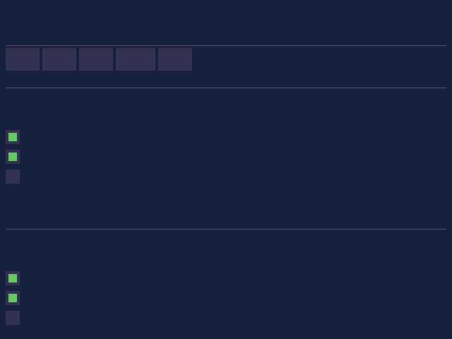

# zig-gui

> [!CAUTION]
> This is an experimental research project. It is not ready for production use and will have frequent breaking changes. Use at your own risk.

A high-performance UI library combining event-driven execution, immediate-mode API, and universal targeting.

<p align="center">
  
</p>

## Rendered Output

Real pixel output from the BYOR (Bring Your Own Renderer) draw system - a Linear-style issue tracker:

<p align="center">
  
</p>

*130 draw commands → SoftwareBackend → 1200×800 pixels. Sidebar, issue detail, comments, tags, avatars. Text rendering coming soon. Generated with `zig build gui-demo`.*

## Goals

- **0% idle CPU** on desktop (event-driven, blocks on input)
- **<10μs per element** layout computation
- **<32KB RAM** for embedded systems
- **Same code** runs on desktop, games, embedded, mobile

## Quick Start

```zig
const std = @import("std");
const gui = @import("zig-gui");
const Tracked = gui.Tracked;

const AppState = struct {
    counter: Tracked(i32) = .{ .value = 0 },
};

fn myApp(g: *gui.GUI, state: *AppState) !void {
    try g.text("Counter: {}", .{state.counter.get()});
    if (try g.button("Increment")) {
        state.counter.set(state.counter.get() + 1);
    }
}

pub fn main() !void {
    var gpa = std.heap.GeneralPurposeAllocator(.{}){};
    defer _ = gpa.deinit();

    // Platform owns OS resources
    var platform = try gui.platforms.SdlPlatform.init(gpa.allocator(), .{
        .width = 800,
        .height = 600,
        .title = "Counter",
    });
    defer platform.deinit();

    // App borrows platform via interface
    var app = try gui.App(AppState).init(gpa.allocator(), platform.interface(), .{
        .mode = .event_driven,
    });
    defer app.deinit();

    var state = AppState{};
    try app.run(myApp, &state);
}
```

## Architecture

### Execution Modes

```zig
// Desktop: blocks on events, 0% idle CPU
var app = try App(State).init(allocator, platform.interface(), .{ .mode = .event_driven });

// Games: continuous rendering, 60+ FPS
var app = try App(State).init(allocator, platform.interface(), .{ .mode = .game_loop });

// Embedded: minimal resources, <32KB RAM
var app = try App(State).init(allocator, platform.interface(), .{ .mode = .minimal });
```

### Ownership Model

```
Platform (user owns)
  - Window, GL context, event source
  - Exposes interface() → PlatformInterface (vtable)
        │
        │ borrows
        ▼
App(State) (user owns)
  - Holds PlatformInterface (no ownership)
  - Owns GUI, execution logic
  - Generic over user's State type
```

### State Management

Tracked Signals with 4 bytes overhead per field:

```zig
const AppState = struct {
    counter: Tracked(i32) = .{ .value = 0 },
    name: Tracked([]const u8) = .{ .value = "World" },
};

// Read: .get()
state.counter.get()

// Write: .set() - O(1), zero allocations
state.counter.set(state.counter.get() + 1)
```

## Build

```bash
zig build test              # Run tests
zig build                   # Build debug
zig build -Doptimize=ReleaseFast   # Build release
```

## Platform Support

| Platform | Mode | Status |
|----------|------|--------|
| Desktop (SDL) | event_driven | In progress |
| Games | game_loop | In progress |
| Embedded | minimal | Planned |
| Mobile (iOS/Android) | via C API | Planned |
| Web (WASM) | event_driven | Planned |

## Documentation

- **[DESIGN.md](DESIGN.md)** - Architecture, API reference, technical details
- **[BENCHMARKS.md](BENCHMARKS.md)** - Performance measurements
- **[CLAUDE.md](CLAUDE.md)** - Development guidelines

## Performance

Measured layout performance (see `zig build test`):

| Scenario | Elements | Per-Element |
|----------|----------|-------------|
| Email Client (10% dirty) | 81 | 0.073μs |
| Email Client (full) | 81 | 0.029μs |
| Game HUD (5% dirty) | 47 | 0.107μs |

Comparison with other layout engines:

| Engine | Per-Element |
|--------|-------------|
| Taffy | 0.329-0.506μs |
| Yoga | 0.36-0.74μs |
| zig-gui | 0.029-0.107μs |

## C API

```c
// Platform first (owns OS resources)
ZigGuiPlatform* platform = zig_gui_sdl_platform_create(800, 600, "My App");

// App borrows platform
ZigGuiApp* app = zig_gui_app_create(
    zig_gui_platform_interface(platform),
    ZIG_GUI_EVENT_DRIVEN
);

// Use...
zig_gui_begin_frame(app);
zig_gui_text(app, "Hello from C!");
if (zig_gui_button(app, "Click me")) {
    printf("Clicked!\n");
}
zig_gui_end_frame(app);

// Destroy in reverse order
zig_gui_app_destroy(app);
zig_gui_platform_destroy(platform);
```

## Development Status

**Phase 1: Core Foundation**
- [x] Event-driven execution
- [x] Layout engine integration
- [x] Basic immediate-mode API
- [x] BYOR Draw System (DrawList, DrawData, RenderBackend)
- [x] SoftwareBackend (pixel rendering, clipping, alpha blending)
- [x] GUI → Draw System integration
- [ ] SDL platform backend
- [ ] Text rendering (bitmap font)

**Phase 2: Developer Experience**
- [ ] Hot reload
- [ ] Rich components
- [ ] Style system
- [ ] Developer tools

**Phase 3: Platform Support**
- [ ] OpenGL/Vulkan/Metal
- [ ] Mobile platforms
- [ ] WebAssembly

**Phase 4: Production**
- [ ] ABI-stable C API
- [ ] Language bindings

